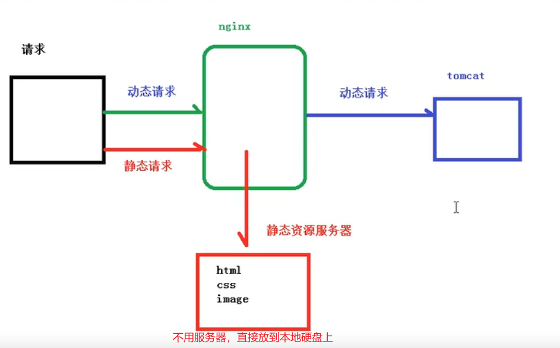
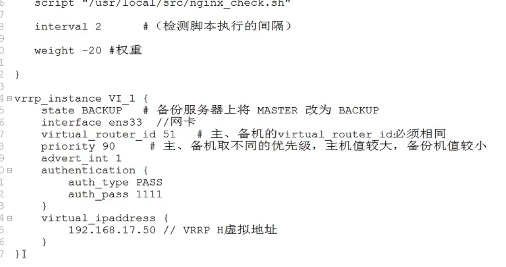

### 1，Nginx，正向代理和反向代理的含义

- 正向代理：就是翻墙用的代理服务器，访问被禁网站需要先访问代理服务器，然后代理服务器再访问google.com等。这就是正向代理的过程。

  即，用户输入真正要访问网站的地址，实际走的是代理服务器地址，然后代理服务器再访问google.com

- 反向代理：相对于正向代理，客户直接访问代理服务器，输入的是代理服务器的地址，然后代理服务器选择其它的服务器，代理服务器的地址是对用户暴露，供用户输入的。

  例，用户访问的是代理服务器的地址，如www.123.com(或8.136.125.36：8060),  而代理服务器再访问别的服务器，实际提供服务的是后边的这些服务器，如：www.456.com(或192.168.2.128：7060)，用户不知道后边这些服务器的地址

### 2，负载均衡

Nginx使用反向代理实现负载均衡，把请求分发到多个服务器

### 3，动静分离

静态资源一个服务器，动态资源一个服务器，Nginx通过反向代理把请求分发到不同的服务器。

### 4，nginx配置文件nginx.conf的加载

 改动nginx.conf文件后，有两种方法使其生效：

1)  一般要重启nginx才可使其生效

2)  使用命令： ./nginx  -s  reload  , 在nginx/sbin目录下执行

3)  nginx.conf中可以设置多个 server {   ..}

### 5，Nginx 配置第一个简单的反向代理步骤

​	1）首先在Windows中配置域名映射，相当于一个DNS，因为本地测无法用DNS

```txt
在目录：C:\Windows\System32\drivers\etc，找到hosts文件
在最后一行设置域名ip地址映射：
192.168.30.128	 www.visit-tomcat.com
前面是Linux服务器的地址，不需加端口号。后面是自定义的域名。
测试，在浏览器输入www.visit-tomcat.com:8080相当于访问192.168.30.128:8080
```

​	2）然后在nginx.conf配置文件中配置

```conf
server {
        listen       80;
        server_name  192.168.30.128;   #Linux服务器的地址,外部访问请求会由nginx接管，因为直接输入ip地址访问会默认访问80端口，而nginx监听着80端口，因此接管了求
       
        location / {
            root   html;
            proxy_pass   http://127.0.0.1:8080;  #这里设置被代理的地址，即本地的Tomcat服务器
            index  index.html index.htm;
        }
}        
```

最后直接输入www.visit-tomcat.com就会直接访问Tomcat主页

### 6，Nginx配置第二个反向代理

实现效果：

访问：192.168.30.128：9001/tech/list.html，被反向代理到服务器的127.0.0.1：8081下Tomcat ../webapps/tech/lit.hml

而访问：192.168.30.128：9001/pro/list.html，被反向代理到服务器的127.0.0.1：8082下Tomcat ../webapps/pro/list.hml

1）开启两个Tomcat，一个端口是8080，另一个是8081，8081端口的Tomcat需要改下配置文件，

​      *启动多个Tomcat并设置不同端口号注意事项参照Tomcat笔记

```xml
<!--改变接收shutdown指令的端口，这里把原SHUTDWON端口8005改为8015-->
<Server port="8015" shutdown="SHUTDOWN">  
....
    <!--端口改为8081-->
    <Connector port="8081" protocol="HTTP/1.1"   
               connectionTimeout="20000"
               redirectPort="8443" URIEncoding="UTF-8"/>
  	<!--如果下面没注释，也把端口改下，可改为8019等，自定义即可，此端口是针对AJP协议的配置，AJP用来链接别的Apache等服务器-->
    <Connector protocol="AJP/1.3"
               address="::1"
               port="8009"
               redirectPort="8443" />  
```

2）注意别忘了开启开启nginx代理的端口，例：9001等

3)  nginx.conf文件设置

```groovy
server {
        listen       9001;
        server_name  192.168.30.128;
        
        location ~ /tech/ {  // "~"表示后边使用的是正则表达式，当外部访问/tech/时转到8081端口服务器
			proxy_pass   http://127.0.0.1:8081; 
        }
        
        location ~ /learn/ {   //访问/learn/ 时转到8082端口的服务器
			proxy_pass   http://127.0.0.1:8082;
        }
}
```

**location 指令说明**  

 该指令用于匹配 URL。 

 语法如下： 

```groovy
location = | ~ | ~* uri {...}
```

 1、= ：用于不含正则表达式的 uri 前，要求请求字符串与 uri 严格匹配，如果匹配 

成功，就停止继续向下搜索并立即处理该请求。 

 2、~：用于表示 uri 包含正则表达式，并且区分大小写。 

 3、~*：用于表示 uri 包含正则表达式，并且不区分大小写。 

 4、^~：用于不含正则表达式的 uri 前，要求 Nginx 服务器找到标识 uri 和请求字 

符串匹配度最高的 location 后，立即使用此 location 处理请求，而不再使用 location  

块中的正则 uri 和请求字符串做匹配。 

 注意：如果 uri 包含正则表达式，则必须要有 ~ 或者 ~* 标识。

### 7，Nginx负载配置负载均衡步骤

以使用两个Tomcat为例，使用多个时同理

一，在两个Tomcat中放入相同的项目，例：webapps/webproject/list.html。Tomcat端口号分别为8081，8082。启动。

```html
8081的list.html
<!--端口号注意改变，访问不同服务器时好区分-->
<h3>Port:8081</h3>  
```

```html
8082的list.html
<!--端口号注意改变，访问不同服务器时好区分-->
<h3>Port:8082</h3> 
```

二，配置nginx.conf

```properties
http {
    ...
    #1,自定义一个服务器群myservers，添加上多个Tomcat的地址及端口号
	upstream myservers{   
		server 192.168.30.128:8081;  
		server 192.168.30.128:8082;
	}
	....
    server {
    	#2,nginx默认监听80端口，也可设置监听其它端口
        listen       80;
        server_name  192.168.30.128;
		....
        location / {
            root   html;
            #3，把myservers赋值给proxy_pass
			proxy_pass   http://myservers;
            index  index.html index.htm;
        }
    }      
 }
```

三，设置好后访问192.168.30.128/web/list.html，nginx就会把访问均衡分配到8081/8082的服务器，默认时轮流分配，也可以设置其它方式，参照下面

### 8，Nginx负载均衡分配策略

nginx **分配服务器策略** 

**第一种 轮询（默认）** 

**每个请求按时间顺序逐一分配到不同的后端服务器，如果后端服务器** **down** **掉，能自动剔除。** 

**第二种** **weight** 

**weight** **代表权重默认为** **1,****权重越高被分配的客户端越多** 

**第三种** **ip_hash** 

**每个请求按访问** **ip** **的** **hash** **结果分配，这样每个访客固定访问一个后端服务器** 

**第四种** **fair****（第三方）** 

**按后端服务器的响应时间来分配请求，响应时间短的优先分配。**

### 9，Nginx配置动静分离

常用的动静分离有两种做法：

一，把静态文件放到一台独立的服务器，处理动态请求的模块放到另一台服务器，这是主流的做法；

二，把静态文件和动态文件放到一个项目里，由nginx来处理区分动静态请求，不常用；

**下面范例使用第一种做法，使用nginx配置动静分离项**：

1）首先在linux本地新建个目录，

​     例 ：/data/html/  :  用来放静态文件， /data/image/  : 放图片

2）配置nginx.conf

​	 还有使用 expires  3  进行设置，后期待研究

```shell
server {
    listen       80;    #代理80端口
    server_name  192.168.30.128;  
	#设置访问路径，这里root /data/是代表本地根路径”192.168.30.128“，当请求192.168.30.128/html/时，
	#会以/data/为根目录开始找，类似于Tomcat设置访问图片的映射路径
    location /html/ {
    root /data/;    
    index  index.html index.htm;
    #autoindex设置为on,表示访问192.168.30.128/html/(这里最有一个斜线要加上，否则访问报错)时，
    #会显示html文件夹内的所有文件目录,不设置默认为off,无法访问192.168.30.128/html/
    autoindex on;
    expires  3 ;  #后期待研究
    }
    location /image/ {
    root /data/;
    #autoindex on;    #这里不设置，默认autoindex为off
    }
}        
```

3）浏览器输入：192.168.30.128/html/ ： 可查看/data/html/文件夹下的目录

​     输入：192.168.30.128/html/static.html : 可访问静态网页

​				192.168.30.128/image/1001.jpg : 可访问图片

   **注意，这里没有用Tomcat，而是通过nginx直接代理访问静态资源**



### 10，Nginx配置高可用示意图

(1)，什么是高可用？

当一台Tomcat服务器宕机后，还有备份的服务器，防止网站不能访问

一台nginx长时间使用可能也会宕机，因此可配置多态nginx，设置主从代理，一台宕机，还有备份机

(2)，为什么配置高可用？

保证服务不间断

(3)配置方法

ip  a : 命令查看网卡绑定的IP，可用来查看nginx是否绑定keepalived的虚拟IP





### 11，Nginx工作原理


### 12，Nginx设置SSL范例

https协议，SSL，工作项目实际设置范例

```txt
server {
		listen       80;
		listen       443 ssl;
		server_name  yz.ukims.cn;

		ssl_certificate      C:/java/nginx-1.19.8/ssl/6368174_yz.ukims.cn.pem;
		ssl_certificate_key  C:/java/nginx-1.19.8/ssl/6368174_yz.ukims.cn.key;

		ssl_session_cache    shared:SSL:1m;
		ssl_session_timeout  5m;

		ssl_ciphers  HIGH:!aNULL:!MD5;
		ssl_prefer_server_ciphers  on;

		# 讲打包好的dist目录文件1
		root C:/java/miniapp/vue;
		location ~* ^/(auth|code|upms|gen|weixin|mall|payapi|doc|webjars|swagger-resources) {
		   proxy_pass http://127.0.0.1:9999;
		   proxy_connect_timeout 15s;
		   proxy_send_timeout 300s;
		   proxy_read_timeout 300s;
		   proxy_set_header X-Real-IP $remote_addr;
		   proxy_set_header X-Forwarded-For $proxy_add_x_forwarded_for;
		}
}
```

